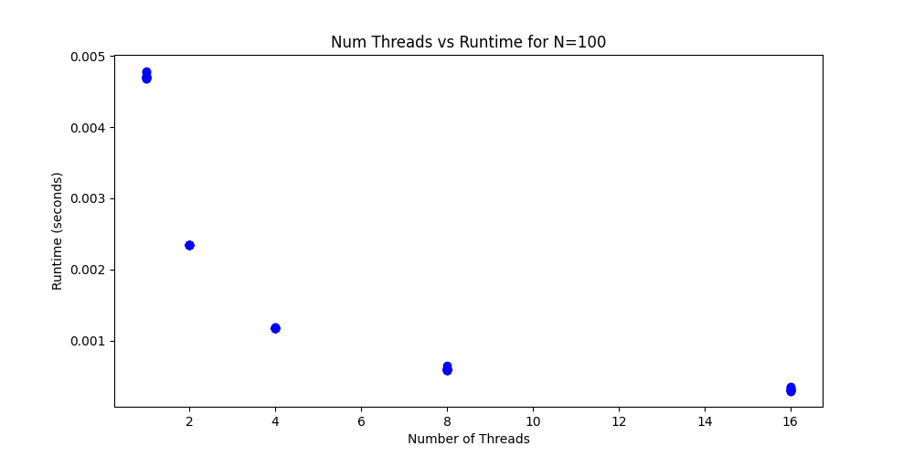

# Project 4: OpenMP and Hybrid Parallelism 

In this project, you will gain experience with the basics of shared-memory parallelism using OpenMP. 
You will also combine distributed- and shared-memory approaches by implementing hybrid parallelism with MPI and OpenMP. 
In addition to the course text book, you may wish to refer to the excellent OpenMP resource pages at <https://computing.llnl.gov/tutorials/openMP/>.

## Part 1: OpenMP Matrix-Matrix Multiplication (TODO: Jared and Jacob)

Consider the simple matrix-matrix multiplication,

```C
for i = 1, N
  for j = 1, N
    for k = 1, N
      C[i,j] += A[i,k] * B[k,j]
```

What strategies could you use to add parallelism using OpenMP threading to this kernel? Is each of the three loops threadable?

Now, let's implement so OpenMP loop parallelism.

1. Modify your MMM code from Project 1 to implement OpenMP threading by adding appropriate compiler directives to the outer loop of the MMM kernel. When compiling the OpenMP version of your code be sure to include the appropriate compiler flag (`-fopenmp` for GCC). Done!
2. Compute the time-to-solution of your MMM code for 1 thread (e.g., `export OMP_NUM_THREADS=1`) to the non-OpenMP version (i.e., compiled without the `-fopenmp` flag). Any matrix size `N` will do here. Does it perform as you expect? If not, consider the OpenMP directives you are using.

Running openMP version of matrix_mult.c on dev-amd20 produces these times when N = 5 for NUM_THREADS = 1
| Run Number | openMP MMM time (seconds) | non-openMP MMM (seconds) |
|---------|----------|----------|
|    1    |  0.00001 |    0.000001     |
|    2    |  0.00001 |    0.000001     |
|    3    |  0.000008 |    0.000000     |
|    4    |  0.00001 |    0.000001     |
|    5    |  0.000007 |    0.000001     |
|    6    |  0.000008 |    0.000001     |
|    7    |  0.000007 |    0.000001     |
|    8    |  0.000010 |    0.000000     |
|    9    |  0.000007 |    0.000001     |
|    10    |  0.000007 |    0.000001     |

At the moment, the non-openMP version of MMM is running faster than the openMP version. This is due to the overhead require to instantiate openMP and only using one thread for all the calculation. 

3. Perform a thread-to-thread speedup study of your MMM code either on your laptop or HPCC. Compute the total time to solution for a few thread counts (in powers of 2): `1,2,4,...T`, where T is the maximum number of threads available on the machine you are using. Do this for matrix sizes of `N=20,100,1000`. Done!

4. Plot the times-to-solution for the MMM for each value of `N` separately as functions of the the thread count `T`. Compare the scaling of the MMM for different matrix dimensions.





Comparing the scaling of the MMM for different matrix dimensions, we can start off by noticing that in all three of our graphs, there is a clear exponential decrease in the time-to-solution when the number of threads available increases, with 1 thread being the slowest and 16 threads being the fastest for MMM size N=20, N=100, and N=1000. This obviously makes sense, since when more threads are available, more calculations can be done concurrently, and therefore the time it takes to find the solution to the MMM should be and is less when more threads are available. When comparing N=20 to N=100 and N=1000, we also notice that the time-to-solution increases as the value of N increases. This also makes sense as when the value of N increases, the size of the matrices in the MMM increases and so the number of calculations required to find the solution increases, resulting in a longer time-to-solution for larger N values like N=1000.

5. Verify that for the same input matrices that the solution does not depend on the number of threads.


The image above is the output of a the program titled MMM_Solution_Verification.c.

To verify that for the same input matrices that the solution does not depend on the number of threads, we ran an experiment where we created two N=5 matrices, with A={{1, 2, 3, 4, 5}, {1, 2, 3, 4, 5}, {1, 2, 3, 4, 5}, {1, 2, 3, 4, 5}, {1, 2, 3, 4, 5}} and B={{5, 4, 3, 2, 1}, {5, 4, 3, 2, 1}, {5, 4, 3, 2, 1}, {5, 4, 3, 2, 1}, {5, 4, 3, 2, 1}}. We then multiplied the A and B matrices using a different number of threads each time with thread amounts equal to {1, 2, 4, 8, 16} and recorded the solution to the MMM in C. As can be seen by the output of our test above, regardless of the number of threads, C always equaled {{150, 120, 90, 60, 30}, {150, 120, 90, 60, 30}, {150, 120, 90, 60, 30}, {150, 120, 90, 60, 30}, {150, 120, 90, 60, 30}}. So, this verifies that for the same input matrices (A and B) that the solution (C) does not depend on the number of threads.

## Part 2: Adding OpenMP threading to a simple MPI application (TODO: Berk and Cheng)

Take a look at the Hello World applications that we have used in past assignments that include basic MPI functionality. Modify one of these applications to include OpenMP. 

1. Wrap the print statements in an `omp parallel` region.
2. Make sure to modify the `MPI_Init` call accordingly to allow for threads! What level of thread support do you need?
3. Compile the code including the appropriate flag for OpenMP support. For a GCC-based MPI installation, this would be, e.g., `mpic++ -fopenmp hello.cpp`.
4. Run the code using 2 MPI ranks and 4 OpenMP threads per rank. To do this, prior to executing the run command, set the number of threads environment variable as `> export OMP_NUM_THREADS=4`. Then you can simply execute the application with the `mpiexec` command: `> mpiexec -n 2 ./a.out`.


5. Explain the output.

In the given scenario where the program employs both MPI and OpenMP to achieve parallelism, the output provides insight into the execution dynamics across different layers of parallel computing. The program is configured to run with 2 MPI processes, each capable of spawning 4 OpenMP threads. This setup harnesses the computational power of multiple cores within a single machine, as evidenced by the execution on node lac-029.i.

When the program runs, each MPI process—essentially acting as a distinct computational worker—initiates its own set of OpenMP threads. These threads represent sub-tasks that the MPI process can execute concurrently, leveraging the shared-memory model of OpenMP within the confines of a single node. The output reflects this structure, listing the MPI rank and the corresponding OpenMP thread ID for each message, all tagged with their node identifier, confirming that the execution is localized to a single machine.

The non-sequential nature of the thread IDs in the output (e.g., the order 0, 3, 2, 1 for Rank 0) is indicative of the concurrent execution inherent in parallel computing. Each thread operates independently and can complete its assigned task at different times, leading to the interleaved pattern observed in the output.

## Part 3: Hybrid Parallel Matrix Multiplication (TODO: Everyone)

Now, let's combine OpenMP and MPI functionality into a hybrid parallel version of the MMM. 

1. Add MPI to  you OpenMP MMM code by distributing the rows of one of the input matrices across MPI ranks. Have each MPI rank perform its portion of the MMM using OpenMP threading. Think very carefully about the structure of the main MMM loops! Once done, gather the resulting matrix on rank 0 and output the result. Verify that for the same input matrices the result does not depend on either the number of MPI ranks or the number of OpenMP threads per rank. 
2. On HPCC, carry out a performance study in which you vary the number of MPI ranks, the number of OpenMP threads per rank, and the matrix size. Make plots showing the times to solution for the various cases. Explain your results.

## What to turn in

To your git project repo, commit your final working code for the above exercises and a concise write-up including all plots, and detailed responses to the questions posed concerning your results. 
